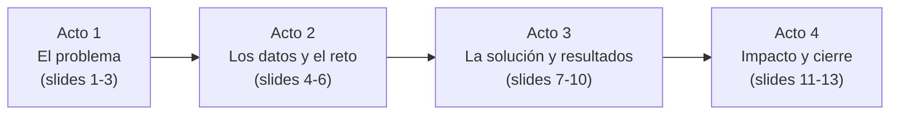

# Guía de Presentación Final — Equipo 1
## Predicción Multi-Horizonte de Ozono en el AMM con LightGBM

> **Restricciones**: 13 diapositivas máximo (incluyendo portada) · 15 minutos · todos participan

---

## 🧭 Hilo Narrativo (el "story arc")

La presentación cuenta **una historia en 4 actos**:



**Mensaje central para toda la presentación:**
> *"Construimos un sistema que predice ozono de 1 a 48 horas al futuro usando datos reales de Monterrey — con datos incompletos, sin imputación — y que puede integrarse al SIMA para emitir alertas tempranas."*

---

## 📋 Diapositiva por Diapositiva

### SLIDE 1 — Portada (~15 seg)
**Título:** Predicción Multi-Horizonte de Ozono Troposférico en el Área Metropolitana de Monterrey

**Contenido:**
- Nombres de todos los integrantes del equipo
- MA2003B · Equipo 1
- Fecha: Octubre 2026
- Un visual limpio (puede ser un ícono de la red SIMA o el skyline de Monterrey)

> [!TIP]
> No pierdan tiempo aquí. "Buenos días, somos el Equipo 1, nuestro proyecto fue..." y pasan a la siguiente.

---

### SLIDE 2 — El Problema (~1:30 min)
**Título sugerido:** *¿Por qué predecir ozono en Monterrey?*

**Contenido:**
- El ozono troposférico (O₃) es el contaminante que más frecuentemente rebasa las normas oficiales (NOM-020) en el AMM
- La red SIMA mide la calidad del aire en **15 estaciones**, pero solo reporta la situación **actual** — no tiene capacidad predictiva
- Sin predicción, las alertas ambientales son **reactivas** (se activan cuando ya se rebasó la norma)

**Pregunta de investigación (resaltar visualmente):**
> *¿Es posible predecir la concentración de ozono troposférico de 1 a 48 horas al futuro utilizando exclusivamente datos históricos de la red SIMA?*

**Lo que dice el expositor:**
- Dar contexto de salud: "El ozono a nivel del suelo causa problemas respiratorios, especialmente en niños y adultos mayores"
- Mencionar que Monterrey tiene una geografía complicada (valle rodeado de montañas) que atrapa contaminantes

---

### SLIDE 3 — Justificación y Objetivo (~1:00 min)
**Título sugerido:** *Objetivo del Proyecto*

**Contenido:**
- **Objetivo general:** Desarrollar un modelo predictivo multi-horizonte de O₃ utilizando machine learning y datos del SIMA
- **Objetivos específicos:**
  1. Analizar los patrones temporales y espaciales del ozono en las 15 estaciones
  2. Evaluar qué variables (temperatura, NOx, radiación solar, viento) son las mejores predictoras
  3. Generar pronósticos a +1h, +4h, +8h, +12h, +24h y +48h con métricas cuantificables
- **Justificación práctica:** Convertir el SIMA de un sistema de *monitoreo* a un sistema de *pronóstico*

---

### SLIDE 4 — Los Datos (~1:30 min)
**Título sugerido:** *Red SIMA: 15 Estaciones, 5 Años, 16 Variables*

**Contenido — dividir en dos bloques:**

**Bloque izquierdo: Las estaciones**
- Mapa esquemático o tabla de las 4 macro-regiones:
  - Poniente/Sierra (SO, SO2, NO2) — mayor altitud ~655 msnm
  - Centro/Norte (CE, NO, NTE, NTE2) — núcleo urbano denso
  - Noreste Industrial (NE, NE2) — corredor industrial
  - Sur/Sureste (SE, SE2, SE3, SUR) — incluye Refinería PEMEX en Cadereyta
- Mencionar: "Excluimos NE3 y NO3 por fallas estructurales de sensores"

**Bloque derecho: Las variables**

| Tipo | Variables |
|------|-----------|
| **Contaminantes** | O₃ (target), NOₓ, PM₁₀, PM₂.₅ |
| **Meteorológicas** | Temperatura, Radiación Solar, Viento (U, V), Humedad |
| **Temporal** | Hora, mes, día de la semana |

- **Periodo:** 2020–2025 (6 años completos)
- **Escala:** Mediciones horarias → millones de registros

---

### SLIDE 5 — El Reto de los Datos Faltantes (~1:30 min)
**Título sugerido:** *El Gran Reto: Datos Reales = Datos Incompletos*

> [!IMPORTANT]
> **Esta es una de las slides más importantes.** Aquí demuestran madurez técnica y diferenciación del equipo.

**Contenido:**
- Los sensores del SIMA fallan frecuentemente: mantenimiento, calibración, cortes eléctricos
- Los "huecos" son **dispersos e irregulares** (no bloques continuos)
- Esto tiene consecuencias para el modelado:

| Enfoque | Requisito | Cobertura real | Veredicto |
|---------|-----------|:--------------:|-----------|
| LSTM / Redes Recurrentes | Secuencias continuas de 24h sin huecos | **17%** del training | ❌ Inviable |
| LSTM con ventana de 48h | Secuencias continuas de 48h | **8.5%** | ❌ Peor aún |
| **LightGBM con lags puntuales** | **Solo necesita que exista cada lag individual** | **>95%** | ✅ Nuestra solución |

**Lo que dice el expositor:**
- "Intentamos Deep Learning primero, pero los datos del mundo real nos obligaron a cambiar de estrategia. Eso no es una debilidad — es honestidad científica y adaptación al problema real."

**Acciones tomadas con datos faltantes:**
- Limpieza por rangos físicos oficiales del SIMA (valores fuera de rango = NaN)
- **No imputamos**: LightGBM maneja NaNs nativamente, lo que nos permitió evaluar con **108,000+ horas reales de 2025**

---

### SLIDE 6 — Metodología (~1:30 min)
**Título sugerido:** *Estrategia de Modelado: Directa Multi-Horizonte*

**Contenido:**

**Diagrama conceptual (hacerlo visualmente claro):**
```
Datos pasados          →  Modelo 1  →  Predicción +1h
(lags, clima,          →  Modelo 2  →  Predicción +4h
 calendario,           →  Modelo 3  →  Predicción +8h
 features              →  Modelo 4  →  Predicción +12h
 ingenierizados)       →  Modelo 5  →  Predicción +24h
                       →  Modelo 6  →  Predicción +48h
```

**Puntos clave:**
- **Estrategia Directa**: 6 modelos LightGBM independientes (no recursivo → no acumula error)
- **Algoritmo**: Gradient Boosting (LightGBM) — ensemble de árboles de decisión
- **Partición temporal estricta (no aleatoria):**
  - Train: 2020–2023
  - Validación: 2024 (early stopping, paciencia=50-80 iteraciones)
  - **Test: 2025** (datos nunca vistos — evaluación honesta)

**Técnicas estadísticas a mencionar** (sin explicar a detalle porque se vieron en clase):
- Gradient Boosting / árboles de decisión
- RMSE, MAE, R² como métricas
- Validación temporal out-of-sample
- Mencionar brevemente: "También usamos OLS con errores HAC Newey-West en la etapa exploratoria, pero el R² fue de 0.36 — insuficiente para predicción operativa"

---

### SLIDE 7 — Feature Engineering (~1:15 min)
**Título sugerido:** *Features Inteligentes: Codificando la Química del Ozono*

> [!NOTE]
> Esta slide es donde muestran que no solo "corrieron un modelo", sino que **entendieron el problema**.

**Contenido — mostrar las categorías con ejemplos concretos:**

| Categoría | Ejemplo | Qué le dice al modelo |
|-----------|---------|----------------------|
| **Lags puntuales** | O₃ hace 1h, 12h, 24h | Inercia y ciclo diario |
| **Interacciones químicas** | NOₓ × Radiación Solar | "Receta" de producción de ozono |
| **Tasas de cambio** | ΔO₃/Δt, ΔTemperatura/3h | ¿Está subiendo o bajando? |
| **Resúmenes de ventana** | Máx. O₃ últimas 24h, σ O₃ 6h | ¿Día normal o atípico? |
| **Anomalía vs ayer** | Temp hoy / Temp ayer (misma hora) | ¿Hoy es más caliente que ayer? |

**Dato numérico para resaltar:**
- v1 (solo lags): 52 features → v2 (lags + ingeniería): 80 features (+28 nuevos)

---

### SLIDE 8 — Resultados Principales (~1:30 min)
**Título sugerido:** *Resultados: 6 Modelos, 108,000+ Horas Reales de 2025*

> [!IMPORTANT]
> **La slide más importante de la presentación.** Pónganle el mayor espacio visual.

**Tabla de resultados (usar v2 que es la mejor):**

| Horizonte | RMSE (ppb) | R² | Uso operativo |
|:---------:|:----------:|:--:|:-------------|
| **+1h** | **8.05** | **0.854** | Alertas tempranas inmediatas |
| **+4h** | **10.91** | **0.732** | Alertas reactivas a corto plazo |
| **+8h** | **11.97** | **0.677** | Pronóstico del pico vespertino |
| **+12h** | **12.21** | **0.664** | Boletín matutino del día siguiente |
| **+24h** | **12.76** | **0.633** | Planificación del día siguiente |
| **+48h** | **13.95** | **0.562** | Contingencias ambientales extendidas |

**Gráfica a mostrar:** La comparativa de barras RMSE v1 vs v2, o la curva de R² por horizonte.

**Lo que dice el expositor:**
- "El modelo de +1h explica el 85% de la variabilidad del ozono real, con un error promedio de 8 ppb"
- "Incluso a +48h, el modelo mantiene un R² de 0.56 — sigue siendo informativo para planificación"
- Contextualizar: "La norma NOM-020 establece el umbral en 70 ppb para promedio de 8h. Un error de 8-12 ppb es suficiente para distinguir un día limpio de uno en pre-contingencia"

---

### SLIDE 9 — La Historia que Cuentan los Features (~1:15 min)
**Título sugerido:** *¿Qué Aprende el Modelo? El Cambio de Régimen por Horizonte*

**Gráfica:** El heatmap de importancia de features o el panel de top 15 por horizonte (con colores naranja=nuevo, verde=base)

**Mensaje principal (narrar con la gráfica):**

| Horizonte | Lo que más importa | Interpretación |
|:---------:|:-------------------|:---------------|
| +1h | O₃ reciente, NOₓ, temperatura | El ozono de hace 1 hora predice el de la siguiente (inercia) |
| +4h–8h | Temp. máxima 24h, ΔTemp, radiación | La fotoquímica del día domina el mediano plazo |
| +24h–48h | Mes, hora del día, día de la semana | A 2 días, solo los patrones estacionales sirven |

**Lo que dice el expositor:**
- "Esto no es solo un resultado técnico — tiene implicaciones para la política pública: las alertas a corto plazo deben basarse en monitoreo en tiempo real, pero las de largo plazo deben incorporar el calendario y la estacionalidad"
- Mencionar que `TOUT_vs_yesterday` fue el feature nuevo más útil → "Saber si hoy está más caliente que ayer a la misma hora predice si habrá más ozono"

---

### SLIDE 10 — Impacto del Feature Engineering (~1:00 min)
**Título sugerido:** *¿Sirvió el Feature Engineering?*

**Gráfica:** La barra de mejora porcentual (`07_mejora_porcentual.png`)

**Contenido conciso:**
- **+4h mejoró 4.9%** en RMSE (la mayor ganancia)
- **+8h mejoró 3.6%**, **+1h mejoró 2.3%**
- **+24h y +48h: sin cambio** → A largo plazo, la física reciente ya no importa
- Los 5 features más útiles fueron todos de **temperatura** → La temperatura es el motor principal de la fotoquímica del ozono

> [!TIP]
> Esta slide demuestra rigor experimental: "No solo construimos un modelo, sino que lo mejoramos de forma iterativa y cuantificamos exactamente cuánto mejoró cada componente."

---

### SLIDE 11 — Aplicación Práctica (~1:00 min)
**Título sugerido:** *De Modelo a Herramienta: ¿Cómo se usaría esto?*

**Diagrama de flujo simple:**
```
Datos SIMA         →  Modelos     →  Dashboard    →  Decisiones
(cada hora,           LightGBM       Pronóstico       • Alertas tempranas
 automático)          (6 modelos)    O₃ 1-48h         • Boletines diarios
                                                       • Pre-contingencias
```

**Ejemplos concretos de uso:**

| Escenario | Horizonte | Acción |
|-----------|:---------:|--------|
| Escuela va a hacer evento al aire libre | +4h | Verificar si el pronóstico supera 70 ppb → cancelar o reubicar |
| Gobierno emite boletín matutino | +12h | "Se esperan niveles de O₃ moderados esta tarde" |
| Industria planea actividades de alto NOₓ | +24h | Decidir si posponer operaciones para el día siguiente |

---

### SLIDE 12 — Limitaciones y Trabajo Futuro (~1:00 min)
**Título sugerido:** *Limitaciones y Oportunidades de Mejora*

> [!WARNING]
> **No esconder las limitaciones.** Mencionarlas con honestidad demuestra rigor y madurez. Pero siempre acompañarlas de la oportunidad de mejora.

**Limitaciones honestas:**

| Limitación | Contexto | Oportunidad |
|-----------|----------|-------------|
| El R² baja a 0.56 en +48h | La atmósfera es intrínsecamente caótica a largo plazo | Incorporar datos de pronóstico meteorológico del SMN |
| Depende de la calidad de los sensores SIMA | Si un sensor falla, el lag es NaN | LightGBM ya tolera NaN — pero no sirve si falla toda una estación |
| No incluye VOCs (compuestos orgánicos volátiles) | Los VOCs son co-reactantes del O₃ pero el SIMA no los mide | Lobby para ampliar la red de monitoreo |
| Modelo entrenado con datos 2020-2023 | Podría degradarse con cambio climático o cambios urbanos | Reentrenamiento periódico (anual) |

**Respuesta a la pregunta de investigación:**
> "Sí, es posible predecir O₃ de 1 a 48h al futuro usando datos del SIMA. La predicción es **altamente confiable** a 1-4 horas (R²>0.73) y **útil pero con incertidumbre** a 24-48 horas (R²≈0.56-0.63). Los principales limitantes son la calidad del dato del SIMA y la ausencia de variables meteorológicas externas."

---

### SLIDE 13 — Conclusiones (~1:00 min)
**Título sugerido:** *Conclusiones*

**3-4 conclusiones contundentes (numerarlas):**

1. **El modelo de +1h logra R²=0.854 sobre datos reales de 2025** — suficiente para alertas tempranas operativas con error promedio de 8 ppb
2. **La estrategia de lags puntuales con LightGBM resolvió el problema de datos faltantes** que hacía inviable el Deep Learning, aprovechando >108,000 horas de evaluación
3. **La temperatura es el predictor más importante del ozono en Monterrey**, tanto directamente como a través de sus interacciones con la radiación solar — resultado consistente con la fotoquímica atmosférica
4. **El feature engineering mejoró hasta 4.9% el error** en horizontes de 1-8h, demostrando que incorporar conocimiento de dominio (química atmosférica) mejora el machine learning más que agregar datos brutos

**Cierre:** "El modelo está listo para ser integrado como módulo de pronóstico dentro del SIMA. Gracias."

---

## ⏱️ Distribución de Tiempo Sugerida

| Slide | Tema | Tiempo | Acumulado |
|:-----:|------|:------:|:---------:|
| 1 | Portada | 0:15 | 0:15 |
| 2 | El problema | 1:30 | 1:45 |
| 3 | Objetivo | 1:00 | 2:45 |
| 4 | Los datos | 1:30 | 4:15 |
| 5 | Datos faltantes / LSTM vs LightGBM | 1:30 | 5:45 |
| 6 | Metodología | 1:30 | 7:15 |
| 7 | Feature Engineering | 1:15 | 8:30 |
| 8 | **Resultados principales** | 1:30 | 10:00 |
| 9 | Importancia de features | 1:15 | 11:15 |
| 10 | Impacto del FE | 1:00 | 12:15 |
| 11 | Aplicación práctica | 1:00 | 13:15 |
| 12 | Limitaciones | 1:00 | 14:15 |
| 13 | Conclusiones | 0:45 | **15:00** |

---

## 🎯 Gráficas a Usar (las mejores de cada carpeta)

| Slide | Gráfica | Ruta |
|:-----:|---------|------|
| 8 | Comparativa RMSE v1 vs v2 | [01_comparativa_rmse_v1_vs_v2.png](file:///D:/Codingggg/Notas/Multivariados/MA2003B_Eq1/results/multihorizonte_v2/figures/01_comparativa_rmse_v1_vs_v2.png) |
| 8 | R² por horizonte v1 vs v2 | [02_comparativa_r2_v1_vs_v2.png](file:///D:/Codingggg/Notas/Multivariados/MA2003B_Eq1/results/multihorizonte_v2/figures/02_comparativa_r2_v1_vs_v2.png) |
| 8 | Serie real vs predicho | [05_serie_real_vs_pred_v2.png](file:///D:/Codingggg/Notas/Multivariados/MA2003B_Eq1/results/multihorizonte_v2/figures/05_serie_real_vs_pred_v2.png) |
| 9 | Panel de importancia (verde/naranja) | [03_feature_importance_v2_panel.png](file:///D:/Codingggg/Notas/Multivariados/MA2003B_Eq1/results/multihorizonte_v2/figures/03_feature_importance_v2_panel.png) |
| 9 | Heatmap de features nuevos | [04_heatmap_features_nuevos.png](file:///D:/Codingggg/Notas/Multivariados/MA2003B_Eq1/results/multihorizonte_v2/figures/04_heatmap_features_nuevos.png) |
| 10 | Mejora porcentual por horizonte | [07_mejora_porcentual.png](file:///D:/Codingggg/Notas/Multivariados/MA2003B_Eq1/results/multihorizonte_v2/figures/07_mejora_porcentual.png) |
| 10 | Scatter real vs predicho | [06_scatter_v2.png](file:///D:/Codingggg/Notas/Multivariados/MA2003B_Eq1/results/multihorizonte_v2/figures/06_scatter_v2.png) |

> [!CAUTION]
> **No usen capturas de pantalla de código.** Las gráficas PNG ya tienen resolución 300 DPI — úsenlas directamente en el PPT. Si necesitan mostrar algo del proceso, usen diagramas conceptuales, no screenshots de Python.

---

## ❓ Preguntas que Probablemente les Hagan (y cómo responder)

### "¿Por qué LightGBM y no Random Forest o XGBoost?"
> "Los tres son gradient boosting / ensemble de árboles. LightGBM tiene dos ventajas: manejo nativo de NaN sin imputación, y entrenamiento más rápido con datasets grandes (108K+ horas × 80 features). Conceptualmente, los resultados serían similares con XGBoost."

### "¿Por qué no hicieron imputación de datos faltantes?"
> "Imputar introduce sesgo — especialmente en series temporales de calidad del aire donde los valores son altamente variables hora a hora. LightGBM puede aprender de observaciones incompletas sin inventar datos ficticios. Esto nos permitió usar >95% de las observaciones en lugar de descartar el 83% que requeriría LSTM."

### "¿Qué tan bueno es un R² de 0.85? ¿Y de 0.56?"
> "Un R² de 0.85 significa que el modelo explica el 85% de la variabilidad real del ozono. Para contexto, el modelo econométrico clásico (OLS con rezagos) dio R²=0.36. En predicción meteorológica operativa, un R²>0.7 se considera bueno y >0.8 excelente. El 0.56 a +48h refleja la incertidumbre intrínseca de la atmósfera a 2 días — es un techo físico, no una limitación del modelo."

### "¿Por qué excluyeron NE3 y NO3?"
> "NE3 (Pesquería) tiene interrupciones de meses completos y solo operó parcialmente en el periodo de estudio. NO3 (García) presenta fallas estructurales similares. Incluirlas contaminaría el entrenamiento con patrones incompletos. Las 13 estaciones restantes tienen cobertura suficiente."

### "¿Cómo se implementaría esto en la realidad?"
> "El SIMA ya transmite datos cada hora a una base de datos central. Nuestros modelos son archivos LightGBM de <5 MB que se cargan en milisegundos. Un script podría ejecutarse cada hora: lee los últimos datos del SIMA, calcula los lags y features, y genera las 6 predicciones. Es viable incluso en un servidor básico."

### "¿Por qué no usaron variables como humedad, presión o precipitación?"
> "Las incluimos en el análisis exploratorio pero su aporte marginal fue mínimo comparado con temperatura, radiación solar y NOₓ. Podrían agregarse en una versión futura sin cambiar la arquitectura."

### "¿El MAPE es alto (34-70%). ¿No es eso malo?"
> "El MAPE se distorsiona cuando los valores reales son cercanos a cero. En la noche, el O₃ baja a 2-5 ppb, entonces un error de 2 ppb da MAPE de 40-100%. Por eso reportamos RMSE y MAE como métricas principales — son más informativas para este tipo de datos."

---

## 👥 Sugerencia de Asignación por Integrante

Si son 4-5 personas, una posible división:

| Integrante | Slides | Tema | Duración |
|:----------:|:------:|------|:--------:|
| **A** | 1-3 | Problema, pregunta, objetivo | ~3 min |
| **B** | 4-5 | Datos, estaciones, datos faltantes | ~3 min |
| **C** | 6-7 | Metodología y feature engineering | ~3 min |
| **D** | 8-10 | Resultados y análisis | ~4 min |
| **E** (o repartir) | 11-13 | Aplicación, limitaciones, conclusiones | ~3 min |

> [!TIP]
> En las preguntas, **no dejen que solo uno responda todo**. Si preguntan sobre datos, que responda B. Si preguntan sobre resultados, que responda D. Eso demuestra que **todos entienden su parte**.

---

## 💡 Tips de Presentación

1. **Letra grande**: Mínimo 24pt para texto, 28pt para títulos. Si no cabe, quita texto, no achiques la letra.
2. **Una idea por slide**: Si tienes que explicar dos cosas, usa dos slides.
3. **Las gráficas ya están a 300 DPI** — insértalas directamente, no como capturas de pantalla.
4. **Ensayen con cronómetro**: 15 minutos pasan rápido. Si una slide toma más de 1:30, hay que recortarla.
5. **No lean la slide**: La slide es un apoyo visual. Ustedes agregan la narrativa, el contexto, el "por qué".
6. **Para la tabla de resultados (slide 8)**: Resalten con color la fila de +1h (la mejor) y pongan en gris claro +48h (la más débil). No escondan lo débil, pero dirijan la atención a lo fuerte.
