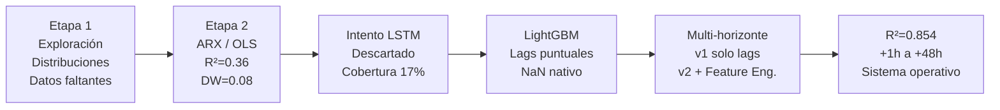

# Guía COMPLETA de Presentación — Equipo 1
## Predicción Multi-Horizonte de Ozono (O₃) en el AMM
### TODO incluido: ARX → LSTM → LightGBM → Feature Engineering

> **Restricciones**: 13 slides (con portada) · 15 min · todos participan · 5 min preguntas

---

## 🧭 El "Story Arc" — La Evolución Completa del Proyecto



**Mensaje central:**
> *"Recorrimos un camino desde la regresión clásica hasta el machine learning avanzado, aprendiendo de cada limitación: el ARX reveló la importancia de temperatura y NOₓ pero no tenía poder predictivo suficiente; el LSTM era teóricamente superior pero los datos reales lo hicieron inviable; LightGBM con ingeniería de features resolvió ambos problemas y produce predicciones operativas de 1 a 48 horas."*

---

## 📋 Las 13 Diapositivas

---

### SLIDE 1 — Portada (~15 seg)

**Título:** Predicción Multi-Horizonte de Ozono Troposférico en el Área Metropolitana de Monterrey mediante Gradient Boosting

- Nombres de todos los integrantes
- MA2003B · Equipo 1 · Octubre 2026
- Visual limpio (logo SIMA o skyline Monterrey)

---

### SLIDE 2 — El Problema y Pregunta de Investigación (~1:30)

**Título:** *¿Podemos anticipar la contaminación por ozono en Monterrey?*

**Bloque 1 — El problema:**
- El O₃ troposférico es el contaminante que más rebasa la NOM-020 en el AMM
- Causa problemas respiratorios (niños, adultos mayores, personas con asma)
- Monterrey: valle rodeado de montañas → atrapa contaminantes
- El SIMA actual solo reporta la situación **actual** — no predice

**Bloque 2 — Pregunta de investigación (resaltar visualmente):**
> *¿Es posible predecir la concentración de ozono troposférico de 1 a 48 horas al futuro utilizando exclusivamente datos históricos del SIMA?*

**Objetivo:** Desarrollar un sistema predictivo multi-horizonte evaluado con datos reales de 2025

---

### SLIDE 3 — Los Datos: Red SIMA (~1:30)

**Título:** *15 Estaciones · 16 Variables · 6 Años · Millones de Registros*

**Bloque izquierdo — Estaciones y regiones:**

| Macro-Región | Estaciones | Característica |
|:-------------|:-----------|:---------------|
| Poniente/Sierra | SO, SO2, NO2 | Pie de Sierra Madre, ~655 msnm |
| Centro/Norte | CE, NO, NTE, NTE2 | Núcleo urbano denso |
| Noreste Industrial | NE, NE2 | Corredor industrial, acereras |
| Sur/Sureste | SE, SE2, SE3, SUR | Incluye Refinería PEMEX (Cadereyta) |

- *NE3 y NO3 excluidas por fallas estructurales de sensores*

**Bloque derecho — Variables:**

| Tipo | Variables | Unidades |
|:-----|:---------|:---------|
| **Target** | O₃ | ppb |
| **Contaminantes** | NOₓ, PM₁₀, PM₂.₅, CO, SO₂, NO, NO₂ | ppb / μg/m³ |
| **Meteorológicas** | Temperatura, Radiación Solar, Viento (U,V), Humedad, Presión | °C, kW/m², km/h, %, mmHg |
| **Temporal** | Hora, mes, día de semana | — |

- **Periodo:** 2020–2025 · Mediciones horarias
- **Limpieza:** Rangos físicos oficiales del SIMA (fuera de rango → NaN)

**Gráfica sugerida:** [heatmap_pct_valido_estacion_variable.png](file:///D:/Codingggg/Notas/Multivariados/MA2003B_Eq1/results/figures/heatmap_pct_valido_estacion_variable.png) o [heatmap_correlacion.png](file:///D:/Codingggg/Notas/Multivariados/MA2003B_Eq1/results/figures/heatmap_correlacion.png)

---

### SLIDE 4 — Exploración de Datos (Etapa 1) (~1:15)

**Título:** *Exploración: Distribuciones, Correlaciones y Patrones Temporales*

**Contenido:**

- **Distribuciones:** O₃ se ajusta razonablemente a una distribución **lognormal** (sesgo positivo, cola derecha por episodios de alta contaminación)
  - *Nota metodológica:* Con N>400K, el test KS rechaza cualquier distribución teórica por potencia estadística excesiva. El ajuste es comparativo, no de hipótesis formal.

- **Correlaciones clave descubiertas:**
  - O₃ vs Temperatura: **r = +0.51** en lag 2h (la más fuerte)
  - O₃ vs Radiación Solar: **r = +0.60** en lag 5h (máximo |r|)
  - O₃ vs NOₓ: **r = −0.29** en lag 1h (precursor que se consume)
  - PM₁₀ y PM₂.₅: correlación débil con O₃ (r < 0.12)

- **Datos faltantes:** Huecos dispersos e irregulares en todas las estaciones (mantenimiento, calibración, cortes eléctricos). No son bloques continuos.

**Gráficas sugeridas:** [Etapa3_01_Distribuciones.png](file:///D:/Codingggg/Notas/Multivariados/MA2003B_Eq1/results/figures/Etapa3_01_Distribuciones.png) o [CCF_O3_vs_predictores.png](file:///D:/Codingggg/Notas/Multivariados/MA2003B_Eq1/results/figures/CCF_O3_vs_predictores.png)

**Lo que dice el expositor:**
- "El análisis exploratorio nos dijo dos cosas: la temperatura y la radiación solar son los predictores más fuertes del ozono, y los datos tienen muchos huecos que van a ser un problema para modelos que requieren secuencias continuas."

---

### SLIDE 5 — Etapa 2: Modelo ARX / OLS (~1:30)

**Título:** *Primer Modelo: Regresión con Rezagos Distribuidos (ARX)*

> [!IMPORTANT]
> **Esta slide demuestra que empezaron con lo que se vio en clase y fueron evolucionando.** No es un "fracaso" — es la base estadística que informó todo lo demás.

**El modelo:**
$$O_{3,8h} = \beta_0 + \beta_1 \cdot \text{TOUT}_{t-2} + \beta_2 \cdot \text{SR}_{t-17} + \beta_3 \cdot \text{NOX}_{t-1} + \beta_4 \cdot \text{PM10}_{t-8} + \beta_5 \cdot \text{Viento} + \text{Dummies regionales} + \varepsilon$$

**Resultados:**

| Métrica | Valor |
|:--------|:------|
| R² (entrenamiento) | **0.3591** → 0.3629 con dummies regionales |
| R² (test 2025) | **0.3469** — buena generalización, sin sobreajuste |
| RMSE train / test | 11.87 / 13.33 ppb |
| Durbin-Watson | **0.08** ← autocorrelación temporal severa |
| N observaciones | 413,036 |

**Predictores más importantes (coeficientes estandarizados |β*|):**

| # | Predictor | β* | Interpretación |
|:-:|:----------|:--:|:---------------|
| 1 | TOUT_lag_2 | **+0.397** | Temperatura es el driver #1 |
| 2 | SR_lag_17 | −0.204 | Radiación solar con retraso fotoquímico |
| 3 | NOX_lag_1 | −0.161 | NOₓ se consume para formar O₃ |
| 4 | PM10_lag_8 | +0.140 | Partículas como proxy de actividad |
| 5 | V_Wind | +0.094 | Componente norte-sur del viento |

**Errores robustos HAC (Newey-West, maxlags=24):**
- Necesarios porque DW=0.08 → autocorrelación extrema invalida errores OLS clásicos
- Hallazgo clave: `region_Poniente_Sierra` pierde significancia (p=0.064) al corregir por HAC → su efecto aparente era espurio
- `PM2.5_lag_8` baja de *** a * (p=0.03) → inflada por autocorrelación

**Gradiente espacial (región × nivel PM₂.₅ → O₃ promedio):**

| Región | PM₂.₅ Bajo | PM₂.₅ Alto | Δ |
|:-------|:----------:|:----------:|:-:|
| Poniente/Sierra | 29.1 ppb | 25.9 ppb | −3.2 |
| Centro/Norte | 28.4 ppb | 25.4 ppb | −3.0 |
| Noreste Industrial | 26.3 ppb | 23.8 ppb | −2.4 |
| Sur/Sureste | 27.3 ppb | 27.3 ppb | **≈0** ← Refinería PEMEX |

**Lo que dice el expositor:**
- "El ARX nos confirmó que temperatura y NOₓ son los predictores clave — eso se mantuvo en todos los modelos posteriores"
- "Pero un R² de 0.36 no es suficiente para predicción operativa — explica solo un tercio de la variabilidad"
- "El Durbin-Watson de 0.08 indica que los residuos están altamente autocorrelacionados — hay información temporal que el modelo lineal no captura"

**Gráfica sugerida:** [heatmap_gradiente_region_pm25.png](file:///D:/Codingggg/Notas/Multivariados/MA2003B_Eq1/results/figures/heatmap_gradiente_region_pm25.png)

---

### SLIDE 6 — ¿Por qué no LSTM? El Problema de la Imputación (~1:30)

**Título:** *Caminos que No Funcionaron: LSTM y la Trampa de los Datos Faltantes*

> [!WARNING]
> **Esta slide es CRUCIAL.** Demuestra pensamiento crítico y honestidad científica. No es vergüenza — es rigor.

**El razonamiento inicial:**
- "Si el ARX no captura la dinámica temporal (DW=0.08), probemos redes recurrentes (LSTM) que aprenden patrones secuenciales"
- Problema: LSTM requiere **secuencias continuas sin huecos** de L horas

**La realidad de los datos (tabla de cobertura):**

| Ventana requerida | Cobertura promedio Train | Cobertura promedio Test 2025 |
|:-----------------:|:------------------------:|:----------------------------:|
| L = 12h | ~30% | ~25% |
| L = 24h | **17%** | **~12%** |
| L = 48h | **8.5%** | **<5%** |

**Casos extremos en Test 2025:**
- Estación NE2: **0.73%** de cobertura con L=24h → 64 ventanas de ~8,700 posibles
- Estación NO: **0.92%** → 80 ventanas
- Estación NE2 con L=48h: **0.00%** → literalmente cero ventanas

**¿Y la imputación?**
- Imputar **crea datos ficticios** en un fenómeno altamente variable hora a hora
- Si el 83% de tus datos de entrenamiento son inventados, ¿qué estás prediciendo realmente?
- "Imputar para alimentar un modelo más complejo es como rellenar un examen con respuestas inventadas para que el promedio se vea bien"

**La decisión:**
> Se descarta LSTM. Se adopta **Gradient Boosting (LightGBM)** con lags puntuales, que solo necesita que exista cada lag individual y maneja NaNs nativamente.

**Resultado de la decisión:** De usar ~17% de los datos → a usar **>95%** (108,000+ horas de test)

---

### SLIDE 7 — La Solución: LightGBM Multi-Horizonte (~1:15)

**Título:** *Estrategia Directa: 6 Modelos Independientes con LightGBM*

**Diagrama visual (el concepto central):**
```
                         ┌─ Modelo 1 ─→ Predicción +1h
  Datos hora actual      ├─ Modelo 2 ─→ Predicción +4h
  (lags, clima,          ├─ Modelo 3 ─→ Predicción +8h
   features              ├─ Modelo 4 ─→ Predicción +12h
   ingenierizados)       ├─ Modelo 5 ─→ Predicción +24h
                         └─ Modelo 6 ─→ Predicción +48h
```

**¿Por qué Estrategia Directa y no Recursiva?**
- Recursiva: predices +1h, usas esa predicción para +2h, luego para +3h... → **acumula error**
- Directa: cada modelo aprende directamente su horizonte → **error independiente**

**Ventajas de LightGBM sobre los enfoques anteriores:**

| Característica | ARX (OLS) | LSTM | **LightGBM** |
|:---------------|:---------:|:----:|:------------:|
| Manejo de NaN | ❌ Requiere dropna | ❌ Requiere secuencias completas | **✅ Nativo** |
| Relaciones no-lineales | ❌ Solo lineales | ✅ | **✅** |
| Interacciones entre variables | ❌ Hay que especificarlas | ✅ Aprende | **✅ Aprende** |
| Cobertura de datos utilizada | ~95% (pero con dropna de lags) | **17%** | **>95%** |
| R² alcanzado | 0.36 | No evaluable | **0.854** |

**Partición temporal (no aleatoria):**
- **Train:** 2020–2023 (362K+ observaciones)
- **Validación:** 2024 (early stopping, paciencia 50-80 iteraciones → evita sobreajuste)
- **Test:** 2025 (108K+ horas, datos **nunca vistos**)

---

### SLIDE 8 — Feature Engineering (~1:00)

**Título:** *No Solo Lags: Codificando la Química del Ozono*

**De 52 a 80 features — 28 features nuevos basados en conocimiento del dominio:**

| Categoría | Ejemplo | Qué codifica |
|:----------|:--------|:-------------|
| **Interacciones químicas** | NOₓ × Radiación Solar | La "receta" fotoquímica del O₃ |
| | O₃ / (NOₓ + 1) | Régimen químico: ¿limitado por VOC o NOₓ? |
| **Tasas de cambio** | ΔO₃/1h, ΔTemp/3h | ¿Subiendo o bajando? ¿Rápido o lento? |
| | ΔO₃ vs ayer (24h) | Anomalía respecto al patrón diario |
| **Resúmenes de ventana** | Máx O₃ 24h, σ O₃ 6h | Resumen del día: ¿fue volátil? ¿hubo pico? |
| | Σ Radiación Solar 12h | Energía fotoquímica acumulada en el día |
| **Anomalía vs ayer** | Temp hoy / Temp ayer | ¿Hoy es más caliente que ayer a esta hora? |
| **Contexto urbano** | is_weekend, is_rush_hour | Tráfico vehicular (fuente de NOₓ) |

**Lo que dice el expositor:**
- "Los árboles de decisión no pueden multiplicar variables entre sí — si la producción de ozono depende del producto NOₓ × Radiación Solar, tenemos que darle esa interacción explícitamente"
- "Esto es feature engineering basado en química atmosférica, no solo estadística"

---

### SLIDE 9 — Resultados Principales (~1:30)

**Título:** *Resultados: R² = 0.854 a 1 Hora — Evaluado en 108,000+ Horas Reales de 2025*

> [!IMPORTANT]
> **La slide más importante.** Máximo espacio visual. Estos números son el producto final.

**Tabla de resultados (v2 — la versión final con feature engineering):**

| Horizonte | RMSE (ppb) | R² | Calidad | Uso operativo |
|:---------:|:----------:|:--:|:-------:|:-------------|
| **+1h** | **8.05** | **0.854** | 🟢 Excelente | Alertas tempranas |
| **+4h** | **10.91** | **0.732** | 🟢 Bueno | Alerta reactiva corto plazo |
| **+8h** | **11.97** | **0.677** | 🟡 Aceptable | Pico vespertino |
| **+12h** | **12.21** | **0.664** | 🟡 Aceptable | Boletín matutino |
| **+24h** | **12.76** | **0.633** | 🟡 Aceptable | Planificación día siguiente |
| **+48h** | **13.95** | **0.562** | 🟠 Útil | Contingencias extendidas |

**Contexto para el R²:**
- ARX/OLS: R² = **0.36** → LightGBM v2: R² = **0.854** (mejora de **137%**)
- La norma NOM-020 es 70 ppb (8h). Error de 8-12 ppb es suficiente para distinguir día limpio de pre-contingencia

**Gráficas sugeridas (elegir 1-2):**
- [01_comparativa_rmse_v1_vs_v2.png](file:///D:/Codingggg/Notas/Multivariados/MA2003B_Eq1/results/multihorizonte_v2/figures/01_comparativa_rmse_v1_vs_v2.png) — Barras RMSE v1 vs v2
- [02_comparativa_r2_v1_vs_v2.png](file:///D:/Codingggg/Notas/Multivariados/MA2003B_Eq1/results/multihorizonte_v2/figures/02_comparativa_r2_v1_vs_v2.png) — Curva R² por horizonte
- [05_serie_real_vs_pred_v2.png](file:///D:/Codingggg/Notas/Multivariados/MA2003B_Eq1/results/multihorizonte_v2/figures/05_serie_real_vs_pred_v2.png) — Real vs predicho (muy visual, impacta)

---

### SLIDE 10 — Qué Aprende el Modelo + Feature Engineering (~1:15)

**Título:** *Lo Que el Modelo Revela: El Cambio de Régimen Predictivo*

**Mensaje principal (la slide más "inteligente"):**

| Horizonte | Variables dominantes | Régimen |
|:---------:|:--------------------|:--------|
| **+1h** | O₃ reciente, NOₓ, temperatura actual | **Inercia química** — lo de hace 1 hora predice la siguiente |
| **+4h–8h** | Temp máxima 24h, ΔTemp, NOₓ×SR | **Fotoquímica activa** — las reacciones del día |
| **+24h–48h** | Mes, hora, día de la semana | **Estacionalidad** — solo los patrones del calendario sirven |

**El feature engineering mejoró los horizontes donde la química importa:**

| Horizonte | Mejora en RMSE | Por qué |
|:---------:|:--------------:|:--------|
| +4h | **−4.9%** ⭐ | NOₓ×SR y ΔTemp capturan la fotoquímica activa |
| +8h | **−3.6%** | Resúmenes de ventana 24h dan contexto del día |
| +1h | **−2.3%** | O₃_diff_1h da dirección del cambio |
| +24h, +48h | ≈ 0% | A largo plazo, la química reciente ya no importa |

**El feature nuevo #1:** `TOUT_vs_yesterday` (¿hoy más caliente que ayer?) — la temperatura es el motor de la fotoquímica

**Gráficas sugeridas:**
- [03_feature_importance_v2_panel.png](file:///D:/Codingggg/Notas/Multivariados/MA2003B_Eq1/results/multihorizonte_v2/figures/03_feature_importance_v2_panel.png) — Panel con verde=base, naranja=nuevo
- [07_mejora_porcentual.png](file:///D:/Codingggg/Notas/Multivariados/MA2003B_Eq1/results/multihorizonte_v2/figures/07_mejora_porcentual.png) — Barra de mejora %

---

### SLIDE 11 — La Evolución Completa (~1:00)

**Título:** *El Camino Recorrido: De OLS a Machine Learning*

**Diagrama comparativo (el "arco" del proyecto):**

| Etapa | Modelo | R² (test) | Cobertura test | Veredicto |
|:-----:|:-------|:---------:|:--------------:|:----------|
| **Etapa 2** | ARX / OLS con rezagos | **0.347** | 67,066 h | Insuficiente para predicción (pero reveló los predictores clave) |
| **Intento** | LSTM (descartado) | — | ~12% (inutilizable) | Datos incompletos lo hacen inviable |
| **Etapa 3 v1** | LightGBM + solo lags | **0.847** (+1h) | 108,512 h | Gran salto: ×2.4 en R² |
| **Etapa 3 v2** | LightGBM + Feature Eng. | **0.854** (+1h) | 108,512 h | Mejora focalizada en +4h y +8h |

**Lo que dice el expositor:**
- "Cada etapa construyó sobre la anterior. El ARX nos dijo QUÉ variables importan. El diagnóstico LSTM nos dijo QUÉ algoritmo usar. Y el feature engineering nos dijo CÓMO codificar el conocimiento de la química atmosférica."
- "No fue un camino lineal — fue un proceso de descubrimiento donde cada 'fracaso' informó la siguiente decisión."

---

### SLIDE 12 — Aplicación Práctica + Limitaciones (~1:15)

**Título:** *De Modelo a Herramienta + Limitaciones Honestas*

**Bloque 1 — Aplicación real:**
```
Datos SIMA → Modelos LightGBM → Dashboard → Decisiones
(cada hora)   (6 archivos <5MB)   Pronóstico   • Alertas tempranas
                                  O₃ 1-48h     • Boletines diarios
                                               • Pre-contingencias
```

| Escenario real | Horizonte | Acción |
|:---------------|:---------:|:-------|
| Escuela planea evento al aire libre | +4h | Verificar pronóstico → cancelar si >70 ppb |
| Gobierno emite boletín matutino | +12h | "Se esperan niveles moderados de O₃ esta tarde" |
| Industria con actividades de alto NOₓ | +24h | Decidir si posponer operaciones |

**Bloque 2 — Limitaciones (con honestidad):**

| Limitación | Por qué existe | Oportunidad de mejora |
|:-----------|:---------------|:---------------------|
| R² baja a 0.56 en +48h | La atmósfera es intrínsecamente caótica a >24h | Incorporar pronóstico meteorológico del SMN |
| No incluye VOCs | El SIMA no los mide | Ampliar la red de monitoreo |
| Depende de sensores activos | Si un sensor falla, el lag es NaN | LightGBM lo tolera, pero no si falla toda la estación |
| Modelo entrenado 2020-2023 | Podría degradarse con cambios urbanos/climáticos | Reentrenamiento anual automatizado |
| MAPE alto (34-70%) | Distorsionado por valores nocturnos cercanos a cero | RMSE y MAE son métricas más apropiadas para estos datos |

---

### SLIDE 13 — Conclusiones (~1:00)

**Título:** *Conclusiones*

**5 conclusiones (numeradas, contundentes):**

1. **Sí es posible predecir O₃ de 1 a 48h.** El modelo de +1h alcanza R²=0.854 sobre 108,000+ horas reales de 2025, superando en 137% al modelo econométrico clásico (R²=0.36).

2. **Los datos reales del SIMA tienen huecos dispersos** que hacen inviable el Deep Learning (LSTM: cobertura <17%). LightGBM con lags puntuales y NaN nativo resolvió este problema sin imputación artificial.

3. **La temperatura es el predictor más importante del ozono en Monterrey**, tanto directa como indirectamente — resultado consistente entre el ARX (β*=0.397) y LightGBM (top feature en todos los horizontes).

4. **La ingeniería de features basada en química atmosférica mejoró hasta 4.9% el error** en horizontes de 1-8h, demostrando que incorporar conocimiento del dominio es más valioso que agregar más datos brutos.

5. **El sistema está listo para integrarse al SIMA** como módulo de pronóstico automatizado. Cada modelo ocupa <5MB y genera predicciones en milisegundos.

**Respuesta a la pregunta de investigación:**
> *"La concentración de O₃ es predecible con alta confiabilidad a 1-4 horas (R²>0.73) y con incertidumbre útil a 24-48 horas (R²≈0.56-0.63). Los principales limitantes son la ausencia de VOCs en el SIMA y la caotización inherente de la atmósfera a largo plazo."*

**"Gracias. Estamos abiertos a preguntas."**

---

## ⏱️ Distribución de Tiempo

| Slide | Tema | Tiempo | Acum. |
|:-----:|:-----|:------:|:-----:|
| 1 | Portada | 0:15 | 0:15 |
| 2 | Problema + pregunta | 1:30 | 1:45 |
| 3 | Datos SIMA | 1:30 | 3:15 |
| 4 | Exploración (Etapa 1) | 1:15 | 4:30 |
| 5 | **ARX / OLS (Etapa 2)** | 1:30 | 6:00 |
| 6 | **LSTM descartado + por qué** | 1:30 | 7:30 |
| 7 | LightGBM multi-horizonte | 1:15 | 8:45 |
| 8 | Feature Engineering | 1:00 | 9:45 |
| 9 | **Resultados principales** | 1:30 | 11:15 |
| 10 | Features + mejora FE | 1:15 | 12:30 |
| 11 | Evolución completa | 1:00 | 13:30 |
| 12 | Aplicación + limitaciones | 1:00 | 14:30 |
| 13 | Conclusiones | 0:30 | **15:00** |

---

## 🎯 Inventario de Gráficas Disponibles

### De la Etapa 2 / Exploración:

| Gráfica | Slide sugerida | Ruta |
|:--------|:--------------:|:-----|
| Heatmap correlación | 3 o 4 | [heatmap_correlacion.png](file:///D:/Codingggg/Notas/Multivariados/MA2003B_Eq1/results/figures/heatmap_correlacion.png) |
| Distribuciones | 4 | [Etapa3_01_Distribuciones.png](file:///D:/Codingggg/Notas/Multivariados/MA2003B_Eq1/results/figures/Etapa3_01_Distribuciones.png) |
| CCF O₃ vs predictores | 4 o 5 | [CCF_O3_vs_predictores.png](file:///D:/Codingggg/Notas/Multivariados/MA2003B_Eq1/results/figures/CCF_O3_vs_predictores.png) |
| Gradiente región × PM₂.₅ | 5 | [heatmap_gradiente_region_pm25.png](file:///D:/Codingggg/Notas/Multivariados/MA2003B_Eq1/results/figures/heatmap_gradiente_region_pm25.png) |
| Boxplot estaciones | 3 | [boxplot_estaciones.png](file:///D:/Codingggg/Notas/Multivariados/MA2003B_Eq1/results/figures/boxplot_estaciones.png) |
| Heatmap % válido | 3 o 6 | [heatmap_pct_valido_estacion_variable.png](file:///D:/Codingggg/Notas/Multivariados/MA2003B_Eq1/results/figures/heatmap_pct_valido_estacion_variable.png) |
| Heatmap rachas | 6 | [heatmap_rachas_estacion_variable.png](file:///D:/Codingggg/Notas/Multivariados/MA2003B_Eq1/results/figures/heatmap_rachas_estacion_variable.png) |
| Feature importance LightGBM base | 7 | [lgbm_feature_importance.png](file:///D:/Codingggg/Notas/Multivariados/MA2003B_Eq1/results/figures/lgbm_feature_importance.png) |

### Del Multi-Horizonte v1:

| Gráfica | Slide | Ruta |
|:--------|:-----:|:-----|
| RMSE por horizonte | 9 | [01_rmse_por_horizonte.png](file:///D:/Codingggg/Notas/Multivariados/MA2003B_Eq1/results/multihorizonte/figures/01_rmse_por_horizonte.png) |
| R² por horizonte | 9 | [02_r2_por_horizonte.png](file:///D:/Codingggg/Notas/Multivariados/MA2003B_Eq1/results/multihorizonte/figures/02_r2_por_horizonte.png) |
| Heatmap importancia v1 | 10 | [05_heatmap_importancia.png](file:///D:/Codingggg/Notas/Multivariados/MA2003B_Eq1/results/multihorizonte/figures/05_heatmap_importancia.png) |
| Serie real vs pred v1 | 9 | [06_serie_real_vs_pred.png](file:///D:/Codingggg/Notas/Multivariados/MA2003B_Eq1/results/multihorizonte/figures/06_serie_real_vs_pred.png) |

### Del Multi-Horizonte v2 (Feature Engineering):

| Gráfica | Slide | Ruta |
|:--------|:-----:|:-----|
| **Comparativa RMSE v1 vs v2** | 9 o 11 | [01_comparativa_rmse_v1_vs_v2.png](file:///D:/Codingggg/Notas/Multivariados/MA2003B_Eq1/results/multihorizonte_v2/figures/01_comparativa_rmse_v1_vs_v2.png) |
| **Comparativa R² v1 vs v2** | 9 o 11 | [02_comparativa_r2_v1_vs_v2.png](file:///D:/Codingggg/Notas/Multivariados/MA2003B_Eq1/results/multihorizonte_v2/figures/02_comparativa_r2_v1_vs_v2.png) |
| **Panel importancia v2 (verde/naranja)** | 10 | [03_feature_importance_v2_panel.png](file:///D:/Codingggg/Notas/Multivariados/MA2003B_Eq1/results/multihorizonte_v2/figures/03_feature_importance_v2_panel.png) |
| **Heatmap features nuevos** | 10 | [04_heatmap_features_nuevos.png](file:///D:/Codingggg/Notas/Multivariados/MA2003B_Eq1/results/multihorizonte_v2/figures/04_heatmap_features_nuevos.png) |
| **Serie real vs pred v2** | 9 | [05_serie_real_vs_pred_v2.png](file:///D:/Codingggg/Notas/Multivariados/MA2003B_Eq1/results/multihorizonte_v2/figures/05_serie_real_vs_pred_v2.png) |
| **Scatter real vs pred v2** | 9 | [06_scatter_v2.png](file:///D:/Codingggg/Notas/Multivariados/MA2003B_Eq1/results/multihorizonte_v2/figures/06_scatter_v2.png) |
| **Mejora porcentual FE** | 10 | [07_mejora_porcentual.png](file:///D:/Codingggg/Notas/Multivariados/MA2003B_Eq1/results/multihorizonte_v2/figures/07_mejora_porcentual.png) |

> [!CAUTION]
> **No usen capturas de pantalla de Python/R.** Todas las gráficas ya están a 300 DPI — insértenlas directo al PPT.

---

## ❓ Preguntas Anticipadas (12 preguntas y cómo responder)

### Sobre el ARX:

**"¿Por qué el R² del ARX fue tan bajo?"**
> "Tres razones: (1) la relación O₃-predictores es no-lineal y el OLS solo captura la parte lineal, (2) el Durbin-Watson de 0.08 indica que hay dinámica temporal que el modelo no aprovecha, y (3) usamos promedios de 8h (NOM-020) que suavizan los picos. Aun así, el ARX fue valioso porque nos confirmó que temperatura y NOₓ son los predictores clave."

**"¿Qué son los errores HAC y por qué los usaron?"**
> "Son errores estándar robustos a autocorrelación temporal (Heteroskedasticity and Autocorrelation Consistent). Con un Durbin-Watson de 0.08, los errores OLS clásicos están severamente subestimados — dan falsas significancias. HAC con Newey-West y 24 lags corrige esto. De hecho, al corregir, la variable región_Poniente_Sierra perdió significancia: su efecto era espurio."

**"¿Qué significa el gradiente espacial que encontraron?"**
> "En 3 de las 4 regiones, más PM₂.₅ se asocia con menos O₃ — lo cual tiene sentido químico porque las partículas absorben radicales que forman ozono. Pero en la región Sur/Sureste (donde está la Refinería PEMEX en Cadereyta), ese patrón desaparece. Eso sugiere que la refinería emite tanto precursores de O₃ como PM simultáneamente, rompiendo la relación inversa."

### Sobre el LSTM:

**"¿Realmente intentaron LSTM o solo lo descartaron teóricamente?"**
> "Lo diagnosticamos cuantitativamente. Calculamos las ventanas válidas para cada estación y cada partición. El resultado fue demoledor: para L=24h, la mejor estación (CE) tiene 31% de cobertura en train y la peor (NO) tiene 0% en validación. No es una cuestión de 'intentar más duro' — los datos literalmente no existen para la mayoría de las estaciones."

**"¿Y si hubieran imputado los datos faltantes?"**
> "Imputar el 83% de los datos de entrenamiento significaría que el modelo aprende mayormente de datos ficticios, no reales. Además, las concentraciones de O₃ cambian drásticamente hora a hora (de 5 a 80 ppb). Ningún método de imputación puede recrear esa variabilidad. Optamos por la honestidad: usar los datos que sí tenemos, no inventar los que faltan."

### Sobre LightGBM:

**"¿Por qué LightGBM y no Random Forest o XGBoost?"**
> "Los tres son ensembles de árboles. LightGBM tiene dos ventajas prácticas: manejo nativo de NaN sin imputación (crítico para nuestro problema), y entrenamiento más eficiente con datasets grandes. Conceptualmente los resultados serían similares con XGBoost."

**"¿Qué tan bueno es un R² de 0.85? ¿Y 0.56?"**
> "El ARX dio 0.36 — es la referencia de un modelo clásico lineal. Un R²=0.85 explica el 85% de la variabilidad real del ozono. En predicción ambiental operativa, >0.7 es bueno y >0.8 es excelente. El 0.56 a +48h refleja la incertidumbre intrínseca de la atmósfera a 2 días — es un techo físico, no una limitación del modelo."

**"¿No hay sobreajuste (overfitting)?"**
> "Tres protecciones: (1) la partición es temporal estricta — el test es 2025 completo, nunca visto, (2) usamos early stopping con validación 2024, y (3) incluso el ARX mostró buena generalización (R² train=0.362 vs test=0.347). El LightGBM evalúa en 108K+ horas reales."

### Sobre Feature Engineering:

**"¿Por qué el FE no ayudó en +24h y +48h?"**
> "Porque los features que agregamos resumen las últimas 24 horas (promedios, máximos, tasas de cambio). A +48h, lo que pasó ayer ya no predice lo de pasado mañana. Lo que sí predice es la estacionalidad (mes, hora del día, día de semana), y eso ya lo tenía el modelo base."

**"¿Qué harían diferente si tuvieran más tiempo?"**
> "Tres cosas: (1) incorporar pronósticos meteorológicos del Servicio Meteorológico Nacional para mejorar los horizontes largos, (2) agregar datos de tráfico vehicular como proxy de emisiones de NOₓ, y (3) implementar un dashboard web que se actualice cada hora con las predicciones."

### Sobre la utilidad práctica:

**"¿Esto realmente se podría implementar?"**
> "Sí, y es sorprendentemente simple. El SIMA ya transmite datos cada hora. Nuestros modelos son archivos de <5MB que se cargan en milisegundos. Un script de Python podría ejecutarse cada hora: lee los últimos datos del SIMA, calcula los lags y features, y genera las 6 predicciones. No requiere GPU ni infraestructura especial."

**"¿El MAPE es muy alto (34-70%), ¿eso no es malo?"**
> "El MAPE se distorsiona con valores cercanos a cero. En la noche, O₃ baja a 2-5 ppb — un error de 2 ppb da MAPE de 40-100% aunque el error absoluto sea mínimo. Por eso usamos RMSE y MAE como métricas principales. Es un problema conocido del MAPE en datos con ceros."

---

## 👥 Sugerencia de Roles

| Integrante | Slides | Tema | ~Min |
|:----------:|:------:|:-----|:----:|
| **A** | 1–3 | Problema, datos, contexto | 3:15 |
| **B** | 4–5 | Exploración + ARX/OLS completo | 2:45 |
| **C** | 6–7 | LSTM descartado + LightGBM solución | 2:45 |
| **D** | 8–10 | Feature Eng. + Resultados + Importancia | 3:45 |
| **E** | 11–13 | Evolución + Limitaciones + Conclusiones | 2:30 |

> [!TIP]
> En la ronda de preguntas, que **cada quien responda lo de su sección**. Si preguntan sobre ARX → B. Si preguntan sobre LSTM → C. Si preguntan sobre resultados → D. Eso demuestra que todos entienden.

---

## 💡 Tips Finales

1. **No se disculpen por lo que no funcionó.** El LSTM "fallido" y el ARX "bajo" son fortalezas narrativas — demuestran rigor y adaptación.
2. **Ensayen con cronómetro.** 15 minutos se van volando. Si una slide toma >1:30, recórtenla.
3. **Letra mínimo 24pt.** Si no cabe, quiten texto, no achiquen letra.
4. **Las gráficas ya están a 300 DPI** — NO hagan capturas de pantalla.
5. **Flujo narrativo:** Cada slide debe terminar con una frase que conecte con la siguiente. Ejemplo: Slide 5 termina con "Pero un R² de 0.36 no es suficiente para predicción operativa — necesitábamos algo más poderoso", y slide 6 abre con "Nuestra primera idea fue LSTM..."
