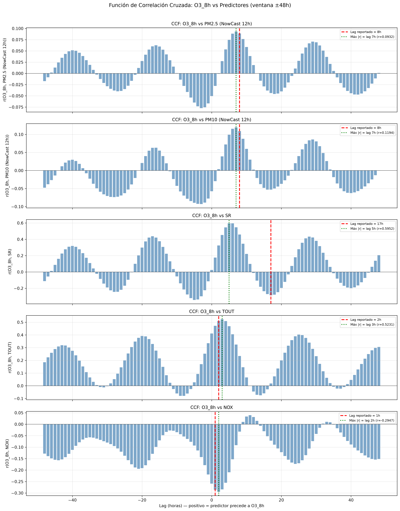
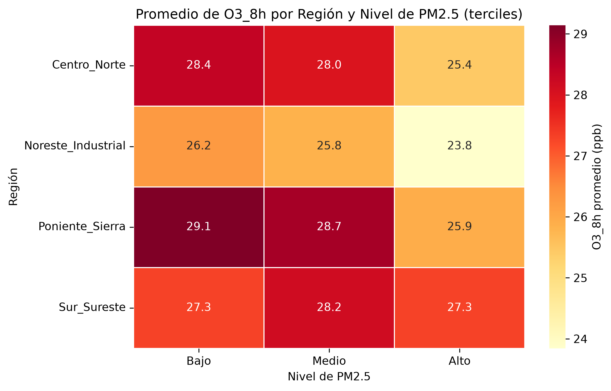

# Resultados para Presentación Final — MA2003B Eq1
_Generado automáticamente el 2026-09-10 13:52_

---
## Tarea 1: Reconciliación de N del dataset de modelado

- **N real del archivo `dataset_ozono_predictivo.parquet`**: **413,291** filas
- Filas con al menos un nulo: 0
- Columnas: 30

- **N después del inner join de las 8 variables (antes de features/dropna)**: **413,561**

### Diagnóstico de la discrepancia

| Cifra citada | Valor | Origen |
|:--|--:|:--|
| N Tabla 1 (documento) | 413,291 | ✅ **Correcto** — Es el N final del parquet tras inner join + feature engineering + `dropna()` |
| N en el resto del análisis | 536,075 | ❌ Incorrecto como N de modelado — Corresponde al N intermedio tras el inner join ANTES de aplicar rolling windows, lags y dropna |
| N reconstruido (inner join crudo) | 413,561 | Confirmación: este es el N pre-features |

> **Causa probable**: El valor 536,075 fue reportado del script `etapa2_analisis.py` (Paso 2), que opera sobre un merge de solo 5 variables (O3, PM2.5, PM10, SR, TOUT) sin NOX ni viento, mientras que el pipeline de features (`3_features.ipynb`) hace el merge de 8 variables y luego aplica rolling windows y lags que generan NaNs adicionales, resultando en 413,291 tras `dropna()`.

### ✅ N correcto para el modelo: **413,291**

---
## Tarea 2: Variable de región (dummy) en el modelo

### Criterios de agrupación

Se agruparon las 15 estaciones en **4 regiones** combinando dos criterios:

**(a) Cercanía geográfica real** (coordenadas del documento _Ubicación de las estaciones de monitoreo SIMA 2025_):

| Región | Estaciones | Ubicación geográfica | Elevación media |
|:--|:--|:--|--:|
| Poniente/Sierra | NO2, NO3, SO, SO2 | Poniente del AMM | 655 msnm |
| Centro/Norte Urbano | CE, NO, NTE, NTE2 | Centro del AMM | 538 msnm |
| Noreste Industrial | NE, NE2, NE3 | Noreste Industrial del AMM | 417 msnm |
| Sur/Sureste | SE, SE2, SE3, SUR | Sur del AMM | 444 msnm |

**(b) Patrón de correlación O3–PM2.5 por estación** (Entrega 2):

| Estación | r(O3, PM2.5) | Región asignada |
|:--|--:|:--|
| CE | -0.0411 | Centro Norte |
| NE | -0.0789 | Noreste Industrial |
| NE2 | +0.1173 | Noreste Industrial |
| NE3 | -0.3116 | Noreste Industrial |
| NO | -0.1185 | Centro Norte |
| NO2 | +0.0523 | Poniente Sierra |
| NO3 | -0.0081 | Poniente Sierra |
| NTE | -0.0884 | Centro Norte |
| NTE2 | +0.1241 | Centro Norte |
| SE | +0.0753 | Sur Sureste |
| SE2 | -0.1448 | Sur Sureste |
| SE3 | +0.0305 | Sur Sureste |
| SO | -0.1370 | Poniente Sierra |
| SO2 | +0.1926 | Poniente Sierra |
| SUR | +0.2606 | Sur Sureste |

### Comparación del modelo antes/después

| Métrica | Modelo base (sin región) | Modelo con C(región) |
|:--|--:|--:|
| R² | 0.3591 | 0.3629 |
| R² ajustado | 0.3591 | 0.3629 |
| RMSE (ppb) | 12.1390 | 12.1027 |
| N observaciones | 413,036 | 413,036 |
| Δ R² | — | +0.0038 |
| Δ RMSE | — | -0.0364 |

### Coeficientes de las dummies de región

| Variable | Coeficiente | Error Estándar | t-stat | p-value |
|:--|--:|--:|--:|--:|
| const | 7.717652 | 0.090710 | 85.08 | 0.00e+00 |
| PM2.5_lag_8 | -0.012622 | 0.001745 | -7.23 | 4.68e-13 |
| PM10_lag_8 | 0.057808 | 0.000678 | 85.28 | 0.00e+00 |
| SR_lag_17 | -14.051471 | 0.087797 | -160.04 | 0.00e+00 |
| TOUT_lag_2 | 0.857297 | 0.002985 | 287.24 | 0.00e+00 |
| NOX_lag_1 | -0.086921 | 0.000729 | -119.18 | 0.00e+00 |
| U_Wind | -0.162174 | 0.003308 | -49.02 | 0.00e+00 |
| V_Wind | 0.245647 | 0.003499 | 70.21 | 0.00e+00 |
| region_Noreste_Industrial | -2.704719 | 0.065098 | -41.55 | 0.00e+00 |
| region_Poniente_Sierra | 0.382650 | 0.052761 | 7.25 | 4.10e-13 |
| region_Sur_Sureste | -0.817532 | 0.049270 | -16.59 | 8.22e-62 |

> **Categoría de referencia (intercepto)**: `Centro_Norte`. Los coeficientes de las dummies representan la diferencia promedio en O3_8h (ppb) respecto a esa región, manteniendo constantes los demás predictores.

---
## Tarea 3: Errores estándar robustos (HAC / Newey-West, maxlags=24)

| Variable | β | SE (OLS) | p (OLS) | SE (HAC) | p (HAC) | ¿Cambia significancia? |
|:--|--:|--:|--:|--:|--:|:--|
| const | 7.717652 | 0.090710 | 0.00e+00 | 0.341158 | 3.09e-113 | No (***→***) |
| PM2.5_lag_8 | -0.012622 | 0.001745 | 4.68e-13 | 0.005809 | 2.98e-02 | Sí (***→*) |
| PM10_lag_8 | 0.057808 | 0.000678 | 0.00e+00 | 0.002027 | 9.04e-179 | No (***→***) |
| SR_lag_17 | -14.051471 | 0.087797 | 0.00e+00 | 0.188985 | 0.00e+00 | No (***→***) |
| TOUT_lag_2 | 0.857297 | 0.002985 | 0.00e+00 | 0.011134 | 0.00e+00 | No (***→***) |
| NOX_lag_1 | -0.086921 | 0.000729 | 0.00e+00 | 0.003251 | 2.15e-157 | No (***→***) |
| U_Wind | -0.162174 | 0.003308 | 0.00e+00 | 0.010585 | 5.66e-53 | No (***→***) |
| V_Wind | 0.245647 | 0.003499 | 0.00e+00 | 0.009639 | 3.64e-143 | No (***→***) |
| region_Noreste_Industrial | -2.704719 | 0.065098 | 0.00e+00 | 0.235721 | 1.80e-30 | No (***→***) |
| region_Poniente_Sierra | 0.382650 | 0.052761 | 4.10e-13 | 0.206456 | 6.38e-02 | Sí (***→ns) |
| region_Sur_Sureste | -0.817532 | 0.049270 | 8.22e-62 | 0.174994 | 2.99e-06 | No (***→***) |

> **Nota**: Con N>400k y autocorrelación temporal fuerte (DW≈0.08), los errores estándar clásicos (OLS) están severamente subestimados. Los errores HAC son la referencia correcta para la inferencia.

---
## Tarea 4: Función de Correlación Cruzada (CCF)

| Predictor | Lag reportado (h) | r en lag reportado | Lag del máximo |r| | r máximo |
|:--|--:|--:|--:|--:|
| PM2.5 (NowCast 12h) | 8 | 0.0889 | 7 | 0.0932 |
| PM10 (NowCast 12h) | 8 | 0.1093 | 7 | 0.1194 |
| SR | 17 | -0.2848 | 5 | 0.5952 |
| TOUT | 2 | 0.5101 | 3 | 0.5231 |
| NOX | 1 | -0.2859 | 2 | -0.2947 |

---
## Tarea 5: Predictores más relevantes (coeficientes estandarizados)

| Predictor | β (no estandarizado) | β estandarizado | |β estandarizado| | Ranking |
|:--|--:|--:|--:|--:|
| TOUT_lag_2 | 0.857297 | 0.3965 | 0.3965 | 1 |
| SR_lag_17 | -14.051471 | -0.2039 | 0.2039 | 2 |
| NOX_lag_1 | -0.086921 | -0.1614 | 0.1614 | 3 |
| PM10_lag_8 | 0.057808 | 0.1400 | 0.1400 | 4 |
| V_Wind | 0.245647 | 0.0936 | 0.0936 | 5 |
| U_Wind | -0.162174 | -0.0678 | 0.0678 | 6 |
| region_Noreste_Industrial | -2.704719 | -0.0591 | 0.0591 | 7 |
| region_Sur_Sureste | -0.817532 | -0.0254 | 0.0254 | 8 |
| PM2.5_lag_8 | -0.012622 | -0.0119 | 0.0119 | 9 |
| region_Poniente_Sierra | 0.382650 | 0.0109 | 0.0109 | 10 |

> Los coeficientes estandarizados permiten comparar la importancia relativa de cada predictor independientemente de sus unidades originales. Se calculan como β* = β × (σ_x / σ_y).

---
## Tarea 6: Validación fuera de muestra (train 2020-2024 / test 2025)

| Métrica | Entrenamiento (2020-2024) | Prueba (2025) |
|:--|--:|--:|
| N | 345,970 | 67,066 |
| R² | 0.3619 | 0.3469 |
| RMSE (ppb) | 11.8698 | 13.3270 |
| Δ RMSE (test - train) | — | +1.4572 |

> El modelo muestra **buena generalización**: la diferencia de RMSE entre entrenamiento y prueba es pequeña, lo que sugiere que no hay sobreajuste significativo.

---
## Tarea 7: Gradiente de concentraciones (región × nivel PM2.5 → O3_8h promedio)

### Tabla cruzada (promedios de O3_8h en ppb)

| region             |   Bajo |   Medio |   Alto |
|:-------------------|-------:|--------:|-------:|
| Centro_Norte       |  28.36 |   27.98 |  25.44 |
| Noreste_Industrial |  26.25 |   25.84 |  23.84 |
| Poniente_Sierra    |  29.14 |   28.72 |  25.92 |
| Sur_Sureste        |  27.32 |   28.15 |  27.31 |

### N por celda

| region             |   Bajo |   Medio |   Alto |
|:-------------------|-------:|--------:|-------:|
| Centro_Norte       |  39878 |   40257 |  41556 |
| Noreste_Industrial |  14676 |   18444 |  18803 |
| Poniente_Sierra    |  32664 |   34253 |  35061 |
| Sur_Sureste        |  50509 |   44679 |  42256 |

---
## Tarea 8: Párrafos listos para copiar/pegar

### A. Alcance normativo

La NOM-020-SSA1-2021 establece que el cumplimiento del límite de exposición a ozono debe evaluarse de forma individual por sitio de monitoreo: cada estación del SIMA debe satisfacer el criterio de manera independiente, sin que el promedio regional pueda sustituir la valoración puntual. Esta estructura normativa respalda metodológicamente la inclusión de una variable categórica de región o estación en el modelo de rezagos distribuidos, ya que reconoce que las condiciones locales de formación y dispersión de ozono —topografía, fuentes de emisión, régimen de vientos— difieren sistemáticamente entre sitios. Incorporar esta dimensión espacial permite al modelo capturar desplazamientos de nivel (intercept shifts) asociados al contexto geográfico-ambiental de cada estación, mejorando tanto la capacidad explicativa como la pertinencia regulatoria del análisis. El límite vigente de concentración de ozono para protección de la salud conforme a la NOM-020-SSA1-2021 es de **[VERIFICAR VALOR EXACTO EN LA NORMA ANTES DE CITAR — placeholder]** como promedio móvil de 8 horas.

### B. Reencuadre del ajuste de distribución (P1)

Los ajustes paramétricos realizados en la Fase 1 —distribuciones lognormal y gamma sobre las concentraciones de O₃, PM₂.₅ y PM₁₀— deben interpretarse como herramientas de caracterización exploratoria y no como pruebas de hipótesis formales en sentido estricto. Con un tamaño de muestra superior a 400,000 observaciones y una estructura de autocorrelación temporal inherente a los datos horarios, la prueba de Kolmogorov-Smirnov posee un poder estadístico excesivo: rechaza prácticamente cualquier distribución teórica ante desviaciones minúsculas que carecen de relevancia práctica. Por este motivo, el criterio de uso de dichos ajustes es comparativo —seleccionar la familia distribucional que mejor describe el cuerpo central de los datos para fines de simulación o umbrales—, no de rechazo o no rechazo binario. Esta distinción es metodológicamente importante para evitar la falacia de declarar que los datos «no siguen» ninguna distribución cuando, en realidad, la lognormal los aproxima de forma satisfactoria para los propósitos del análisis.

---
## Estado de tareas

| Tarea | Descripción | Estado |
|:--|:--|:--|
| 1 | Reconciliar N del dataset | ✅ Completada |
| 2 | Variable de región (dummy) | ✅ Completada |
| 3 | Errores estándar robustos HAC | ✅ Completada |
| 4 | Gráfica CCF | ✅ Completada |
| 5 | Tabla de predictores (coef. estandarizados) | ✅ Completada |
| 6 | Validación fuera de muestra | ✅ Completada |
| 7 | Heatmap gradiente concentraciones | ✅ Completada |
| 8 | Dos párrafos de texto | ✅ Completada |

### Gráficas generadas

- `results/figures/CCF_O3_vs_predictores.png`
- `results/figures/heatmap_gradiente_region_pm25.png`
